# OpenEMR Clinical Co-Pilot Architecture

## Executive Summary (~500 words)

This architecture describes how to add a trustworthy, agentic Clinical Co-Pilot to OpenEMR for the primary workflow in `USERS.md`: a primary care physician preparing between patient rooms in a 90-second window. The design goal is not a general chatbot. It is a constrained, clinical-context assistant that can answer record-grounded questions quickly, cite where facts came from, and fail safely when data is missing or tools fail.

The core integration approach is an OpenEMR custom module plus a separate Python runtime. The OpenEMR module owns user-facing integration, session context, CSRF checks, and ACL enforcement, while the Python service owns orchestration and response generation. This split preserves OpenEMR's existing trust boundaries: user identity and patient access are validated inside OpenEMR before any request reaches the AI runtime. The Python runtime never authenticates end-users directly and is not exposed publicly; it is an internal service reached over the private Docker network.

For MVP data retrieval, we will use OpenEMR-controlled endpoints rather than direct SQL from Python. In practice, the Python service calls internal OpenEMR API endpoints to fetch patient data required by tools (encounters, medications, labs, problem list, schedule context). This adds one internal network hop and more explicit failure modes, but it materially improves auditability, schema decoupling, and security posture. It also keeps access control logic centralized in OpenEMR rather than duplicating authorization semantics in Python data-access code.

LangGraph is used to implement explicit, inspectable orchestration. The graph will include a dedicated verification node before final response delivery. Verification has two required dimensions: (1) source attribution, where claims are mapped to specific records in OpenEMR, and (2) domain constraint enforcement, where responses are screened for high-risk unsupported or overconfident clinical statements. Unsupported claims are either removed or rewritten as uncertainty statements. This makes trust behavior intentional rather than prompt-only.

Model resiliency is built into graph execution through provider fallbacks. If the primary model call fails due to timeout, quota, or provider outage, the graph retries with secondary configuration and records the fallback event in traces. This preserves continuity for clinicians while making degraded behavior visible in observability. We prioritize deterministic tool outputs, concise prompts, and bounded retries to preserve latency in the physician workflow.

Observability for MVP uses LangSmith because it is fast to wire with LangGraph and provides step-level traces, latency, token, and tool-failure visibility required by the project brief. Because trace payloads may include PHI context, production architecture replaces LangSmith with self-hosted Langfuse to keep telemetry inside controlled infrastructure. This migration is a first-class production hardening milestone, not an optional improvement.

The architecture is intentionally staged. MVP emphasizes read-only, patient-scoped summaries and question answering with strict verification and safe fallback behavior. No autonomous writes, order placement, or note signing are allowed. Production hardening then adds stronger secret management, audit event coverage for AI activity, provider policy controls, self-hosted observability, and deeper eval coverage for unauthorized-access attempts, missing-data scenarios, and clinical edge cases. This produces a system that is practical to ship quickly while remaining defensible in clinical and technical review.

---

## Audit Findings Addressed

This section maps each critical finding from `AUDIT.md` to the architecture decision that responds to it.

| # | AUDIT.md Finding | Severity | Architecture Response |
|---|---|---|---|
| 1 | AI query activity is not audit-logged — HIPAA §164.312(b) gap | Critical | PHP bridge writes to `EventAuditLogger` on every agent request before calling Python service. Log entry records: `authUser`, `pid`, query category, timestamp. The full query text and response are not logged (to avoid writing PHI to the audit trail). |
| 2 | PHI sent to external LLM without confirmed BAA | Critical | Architecture accepts this for MVP with synthetic data only. Production gate: BAA with Anthropic must be confirmed before any real patient data enters the system. LangSmith PHI risk addressed by migrating to self-hosted Langfuse before production. |
| 3 | MySQL (port 8320) and phpMyAdmin (port 8310) exposed publicly | High | Endpoint-based data access (Section 6) means Python service calls OpenEMR's own REST API, not MySQL directly. Python never holds DB credentials. MySQL exposure is a server hardening task, not an architecture task — ports must be firewalled before production. |
| 4 | Agent inherits broad session permissions without per-request patient scoping | High | PHP bridge enforces a patient scope check: `pid` in the request must match `pid` in the current session (set by `PatientSessionUtil::setPid()`). The Python service receives only the authorized `pid` — it cannot request data for a different patient. |
| 5 | Prompt injection via patient-controlled data (names, notes) | Medium | Agent prompt architecture separates system instructions from patient data. Tool results are injected as structured data blocks, not as free text instructions. System prompt is immutable — tool outputs cannot override it. |
| 6 | Lab results stored as VARCHAR — numeric reasoning fails | Medium | Lab tool normalizes result values: attempts `float()` parse, falls back to string comparison, and explicitly marks non-parseable values as `non_numeric: true` in tool output. Synthesis prompt instructs agent not to make numeric comparisons on non-numeric values. |
| 7 | `abnormal` flag is inconsistent (`"high"`, `"low"`, `"yes"`, `"no"`, `""`) | Medium | Lab tool normalizes flag to a canonical enum (`high`, `low`, `abnormal`, `normal`, `unknown`) before returning to graph. Agent never sees raw flag values. |
| 8 | Performance: 5 sequential tool calls may breach <5s budget on 1vCPU | Medium | Independent tool calls (medications, labs, problems, allergies) are executed in parallel using `asyncio.gather()`. Encounters are fetched first (sequential) because they provide context for the parallel calls. See Section 12. |
| 9 | AUDIT.md recommended direct MySQL for performance | Note | Architecture overrides this recommendation in favor of endpoint-based access (Section 6). The performance cost is accepted because it is bounded (internal network, no OAuth overhead for module-originated requests) and the security and auditability benefits outweigh the latency difference on the MVP workload. |

---

## 1) Scope and Traceability to Users

The architecture is constrained to use cases defined in `USERS.md`.

| Use case | Required capability | Architecture component |
|---|---|---|
| Between-room patient prep | Fast patient delta summary | LangGraph summarize flow + verification |
| Lab triage | Abnormal lab prioritization | Lab tool endpoint + normalization |
| Medication safety context | Active medication context and interaction flags | Medication tool endpoint + constraint checks |
| Schedule prep | Multi-patient morning briefing | Schedule tool endpoint + aggregation node |
| After-hours recall | Encounter/order recall | Encounter/order tool endpoints |

Non-goals: autonomous chart actions, prescribing, unsourced claims, cross-patient leakage.

---

## 2) System Context

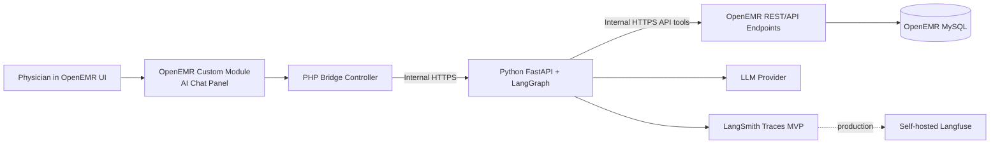

---

## 3) Trust Boundaries and Data Boundaries

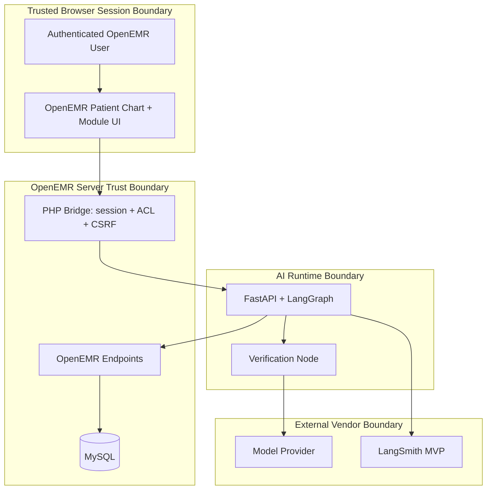

Boundary rules:
- User identity and authorization are enforced in OpenEMR before AI calls.
- Python service is private-network only, no browser direct access.
- AI service receives minimum required context; no unrestricted patient export.
- Response shown to user must pass verification.

---

## 4) Request Lifecycle (End-to-End)

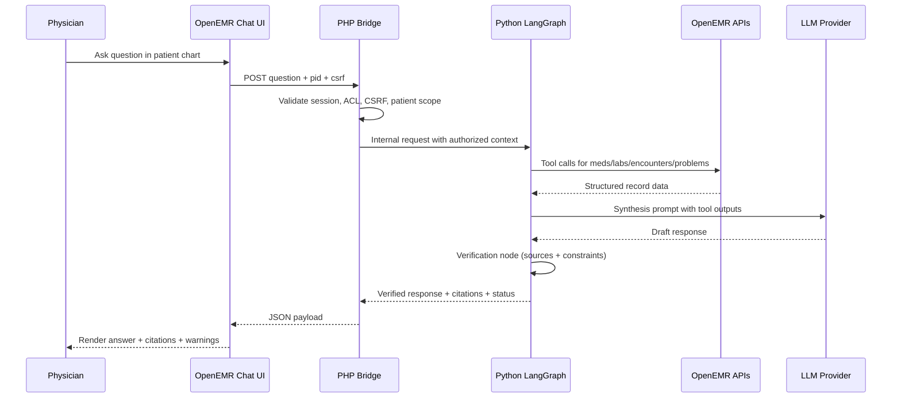

---

## 5) LangGraph Design

### 5.1 Primary Graph

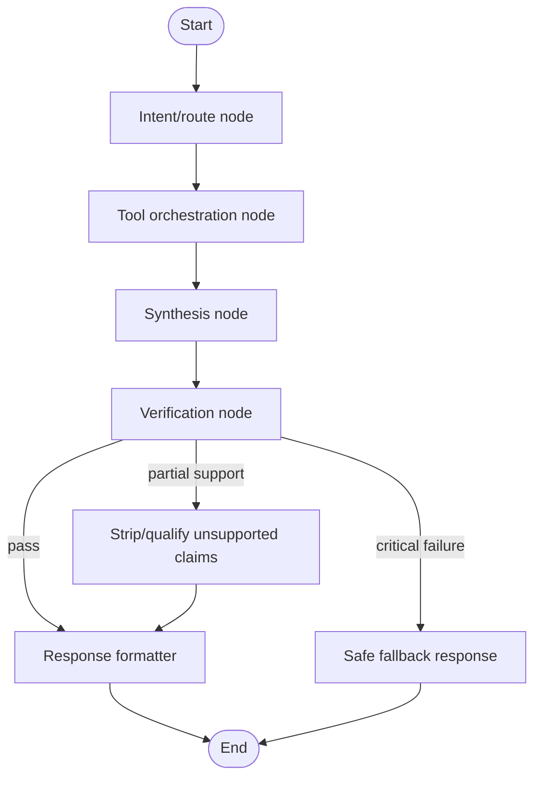

### 5.2 Model Fallback Path

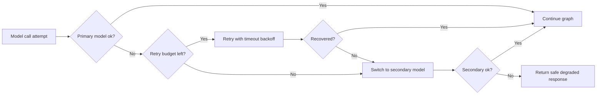

---

## 6) Data Access Strategy (MVP Decision)

### Decision
Use **endpoint-based data access** for MVP: Python tools call internal OpenEMR endpoints rather than direct MySQL queries.

### Why this is selected
- Keeps authorization semantics centralized in OpenEMR.
- Reduces schema-coupling risk while iterating quickly.
- Easier to defend from compliance and safety perspective.
- Allows clearer audit/event instrumentation per data request.

### Endpoint paths used by Python tools

The Python service calls the following OpenEMR internal REST endpoints. All calls go over the Docker internal network. The PHP bridge passes a scoped request token (see Section 7) that the OpenEMR module validates before serving data.

| Tool | Endpoint | Notes |
|---|---|---|
| Patient demographics | `GET /apis/default/api/patient/{pid}` | Returns demographics from `patient_data` |
| Encounter history | `GET /apis/default/api/patient/{pid}/encounter` | Returns encounters ordered by date; agent fetches last 5 |
| Medications | `GET /apis/default/api/patient/{pid}/medication` | `lists` table, `type=medication`, `activity=1` |
| Problem list | `GET /apis/default/api/patient/{pid}/medical_problem` | `lists` table, `type=medical_problem` |
| Allergies | `GET /apis/default/api/patient/{pid}/allergy` | `lists` table, `type=allergy` |
| Lab results | `GET /apis/default/api/patient/{pid}/lab_result` | Joins `procedure_order` → `procedure_report` → `procedure_result`; agent fetches most recent 20 |
| Schedule (morning briefing) | `GET /apis/default/api/patient` with date filter | Used only for multi-patient morning briefing use case |

Note: OpenEMR's REST API requires OAuth2 Bearer tokens for external callers. For internal module-originated calls, the PHP bridge calls the internal endpoint via a server-side HTTP client with a pre-shared service token (see Section 7), bypassing the OAuth2 flow that is designed for external clients.

### Tradeoff accepted
- More moving parts (internal API failures, auth propagation).
- Slightly higher latency than direct DB.

### Mitigation
- Internal network only (low latency).
- Short timeouts + retries with bounded budgets.
- Circuit breaker behavior for non-critical tools.
- Graceful degraded responses when specific tools fail.

---

## 7) Security and Access Controls

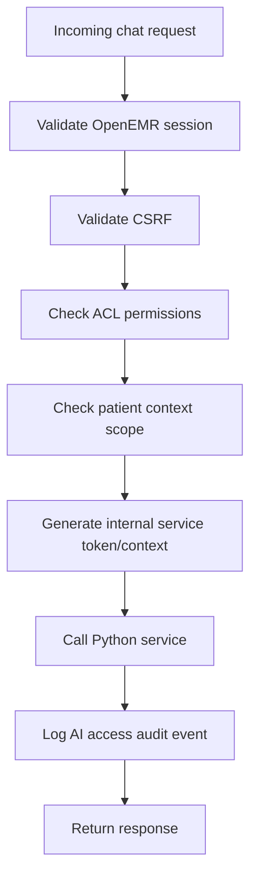

Control set:
- Read-only MVP: no order/note write operations.
- Patient-scoped request handling by chart context.
- Least-privilege service credentialing for internal API calls.
- No secrets in frontend; secret material only server-side.

---

## 8) Verification System

Verification executes after synthesis and before rendering.

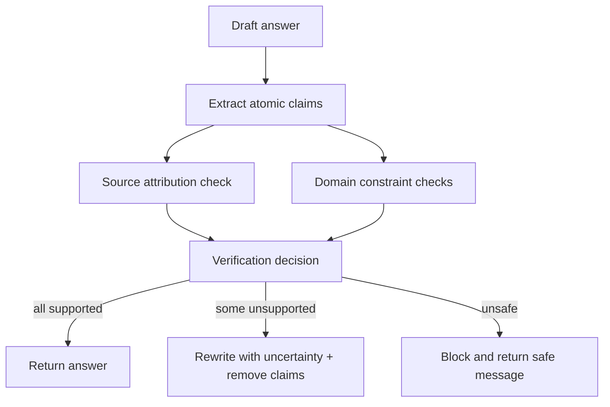

Minimum output contract:
- `answer_text`
- `citations[]` (record ids/types/dates)
- `verification_status` (`pass | partial | fail`)
- `warnings[]` (missing data, tool failures, degraded model)

---

## 9) Failure Modes and Graceful Degradation

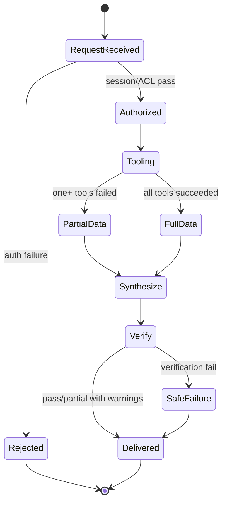

Failure principles:
- Never fabricate missing facts.
- Always disclose degraded mode in UI.
- Prefer partial, sourced output over timeout.
- Hard-fail only on auth or unsafe verification results.

---

## 10) Observability and Telemetry

### MVP: LangSmith
- Full LangGraph traces and step timing.
- Tool success/failure events.
- Token and cost metrics.
- Fallback invocation events (primary -> secondary model).

### Production: Self-hosted Langfuse
- Replace cloud tracing with self-hosted telemetry boundary.
- Keep PHI-bearing traces inside controlled infrastructure.

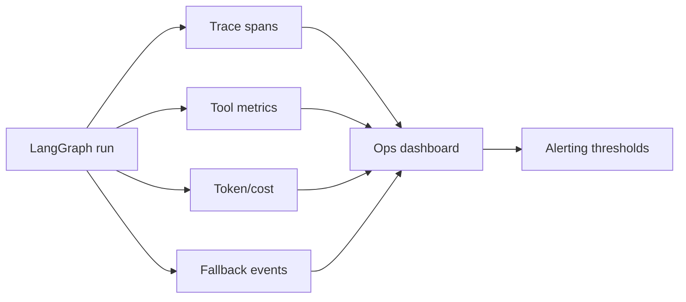

Required operational questions (from brief):
- What happened, in what order?
- How long did each step take?
- Which tools failed, and why?
- What was token/cost usage?

---

## 11) Evaluation Plan

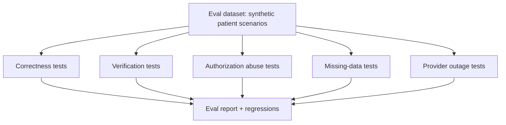

Test categories:
- Fact-grounding pass/fail with required citations.
- Unauthorized patient-access attempts must fail.
- Missing labs/notes should trigger explicit uncertainty.
- Model outage must trigger fallback or safe degraded response.

---

## 12) Performance and Latency Budget

Target: agent response in **<5 seconds** end-to-end (matching AUDIT.md latency budget). The physician has a 90-second between-room window; agent response must complete in a small fraction of it.

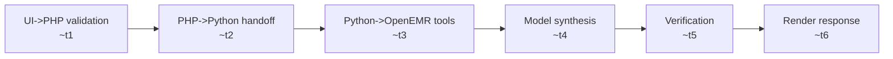

Estimated breakdown per AUDIT.md analysis:
```
PHP bridge validation + HMAC token generation:   ~50ms
Python service routing + token verification:      ~10ms
Tool calls (parallel: meds + labs + problems):   ~150ms  (asyncio.gather, ~40ms each)
Encounters (sequential, fetched first):           ~40ms
LLM inference (Claude, dominant factor):         ~2–4s
Verification node:                               ~200ms
Response serialization + render:                  ~50ms
Total estimate:                                  ~2.5–4.5s  (target: <5s)
```

Latency controls:
- Independent tool calls parallelized via `asyncio.gather()` — medications, labs, problems, allergies run concurrently.
- Encounters fetched first (sequential) as they provide encounter IDs needed by downstream tools.
- Tool response payloads bounded: max 5 encounters, max 20 lab results, max 50 medications.
- Stream response tokens to UI once verification of initial claims is complete — physician sees answer beginning before full generation finishes.

---

## 13) Rollout Plan

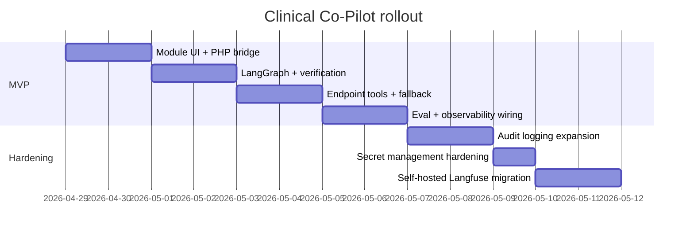

Phases:
1. MVP read-only assistant in patient chart with verification and citations.
2. Reliability hardening (audit coverage, fallback tuning, stricter guardrails).
3. Compliance and operations hardening (self-hosted observability, retention, production controls).

---

## 14) Internal Service Authentication

**Decision: pre-shared secret token, request-scoped, passed as HTTP header.**

The PHP bridge generates a short-lived HMAC token per request, signed with a shared secret stored in the Docker environment (`AI_SERVICE_SECRET`). The token encodes `pid`, `authUser`, and a timestamp (valid for 30 seconds). The Python service verifies the HMAC before processing any request. OpenEMR's internal endpoint handler verifies the same token before serving patient data to the Python tools.

This approach:
- Avoids storing long-lived credentials in the Python service
- Binds each request to a specific patient and user (prevents privilege escalation)
- Expires quickly (replay window: 30 seconds)
- Does not require the Python service to implement OAuth2

The shared secret is set via environment variable and never committed to the repository.

```
PHP bridge:
  token = HMAC-SHA256(key=AI_SERVICE_SECRET, data="pid={pid}&user={user}&ts={ts}")
  POST /agent/query  →  Authorization: Bearer {token}

Python service:
  Verify HMAC, check ts within 30s, extract pid and user from token
  Pass pid + user as context to all tool calls

OpenEMR endpoint handler (called by Python tools):
  Validate same token → confirm pid matches request path → serve data
```

---

## 15) Open Decisions and Risks

1. Citation granularity standard (record-level vs field-level).
2. Which domain constraints to enforce in MVP vs post-MVP.
3. Maximum allowed degraded behavior before request is blocked.

Major known risk: endpoint-centric design adds failure points, but this is acceptable because failures are explicit, observable, and safer than silent privilege drift from direct SQL access.

---

## 16) Architecture Principles

- **Safety over fluency**: unsourced claims are removed, not polished.
- **OpenEMR is the policy authority**: session and ACL remain in PHP boundary.
- **Agent is advisory and read-only** in MVP.
- **Everything observable**: traces, timing, failures, cost.
- **Degraded behavior is explicit** and clinician-visible.

